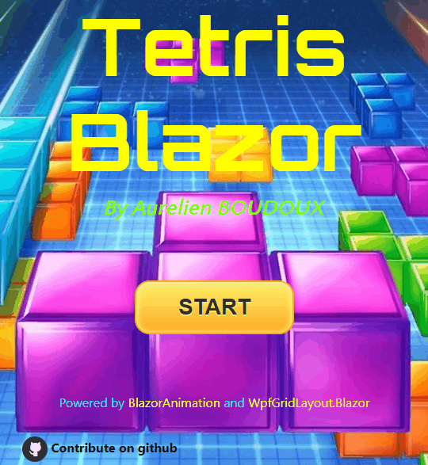

# TetrisBlazor

This is a tetris game written in blazor to demonstrate the usage of [WpfGridLayout.Blazor](https://github.com/aboudoux/WpfGridLayout.Blazor) and [BlazorAnimation](https://github.com/aboudoux/BlazorAnimation) components.

You can play the game at [http://tetris.boudoux.fr](http://tetris.boudoux.fr)

